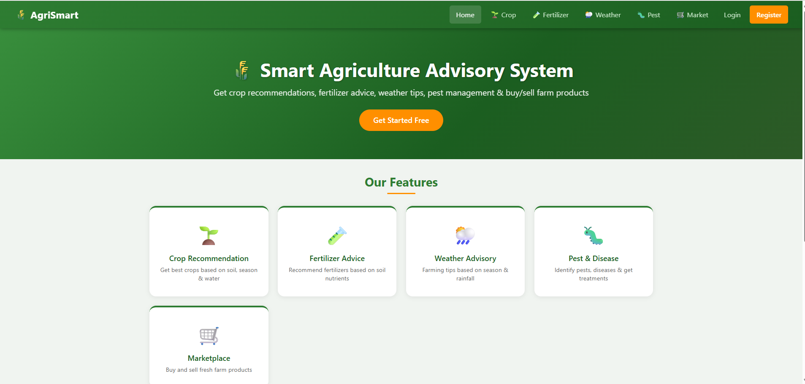
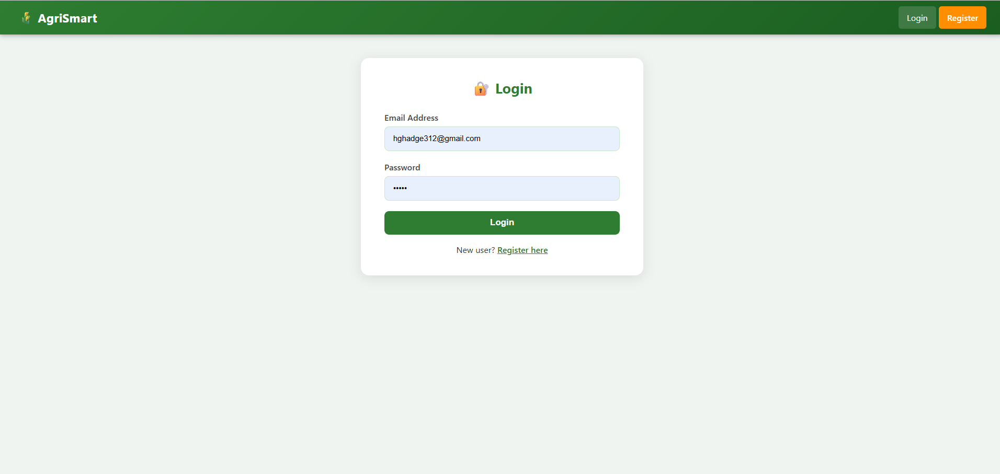
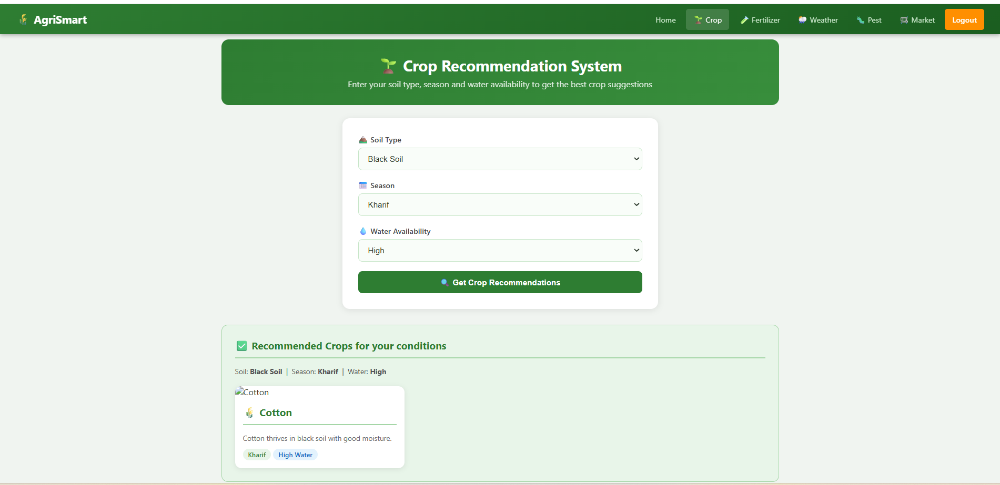
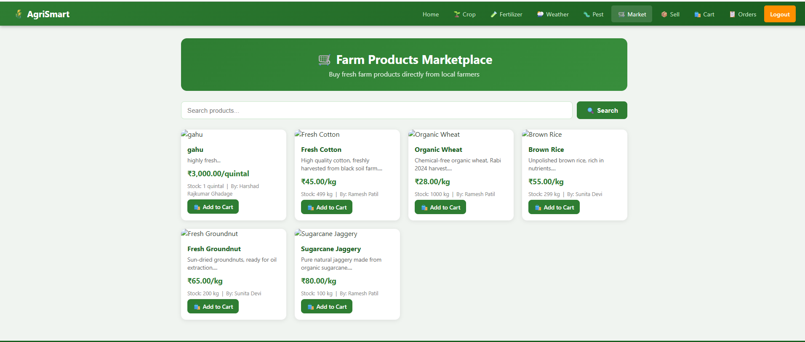
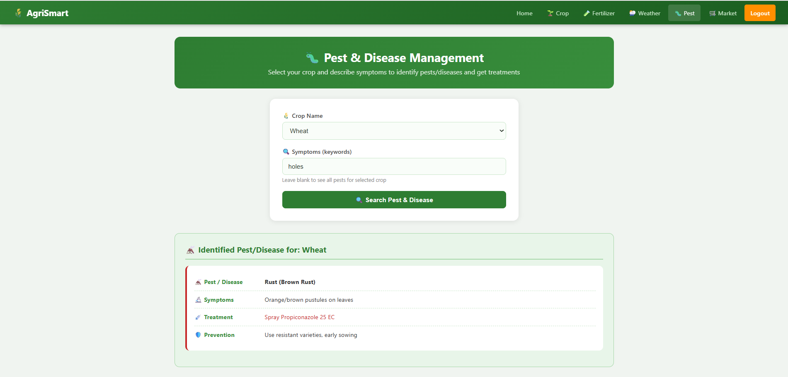

# Smart Agriculture System

A PHP and MySQL based web application that helps farmers with:

- 🌾 Crop Recommendation
- 🧪 Fertilizer Recommendation
- 🐛 Pest & Disease Management
- 🌦 Weather Advisory
- 🛒 Marketplace
- 👨‍🌾 Farmer Registration & Login
- 👨‍💼 Admin Dashboard

## Technologies Used

- PHP
- MySQL
- HTML
- CSS
- JavaScript
- XAMPP

## Installation

1. Clone this repository
2. Import `database.sql`
3. Configure `db.php`
4. Run using XAMPP

# 📸 Project Screenshots

## 🏠 Home Page

---

## 🔐 Login Page

---

## 🌾 Crop Recommendation

---

## 🛒 Marketplace

---

## 🐛 Pest and Disease Management

## Author

Harshad Ghadage
